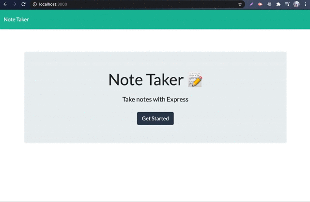

# Note Taker

 

An application that can be used to write, save, and delete notes. This application will use an express backend and save and retrieve note data from a JSON file.

## Installation

1. Download or clone repository
2. Node.js is required to run the application
3. `npm install` to install the required npm packages

## Usage

* To start using the application, open your browser and go to
  
  `http://localhost:3000/`

* Demo of application
  

* Websites
  * [Github](https://github.com/mmeii/11-note-taker)
  * [Live Heroku App](https://murmuring-falls-28433.herokuapp.com/)

## Features

* JavaScript
* Node.js
* Express

## License

  Copyright (c) Mengmei Tu. All rights reserved.
  
  Licensed under the [MIT](LICENSE) license.
  